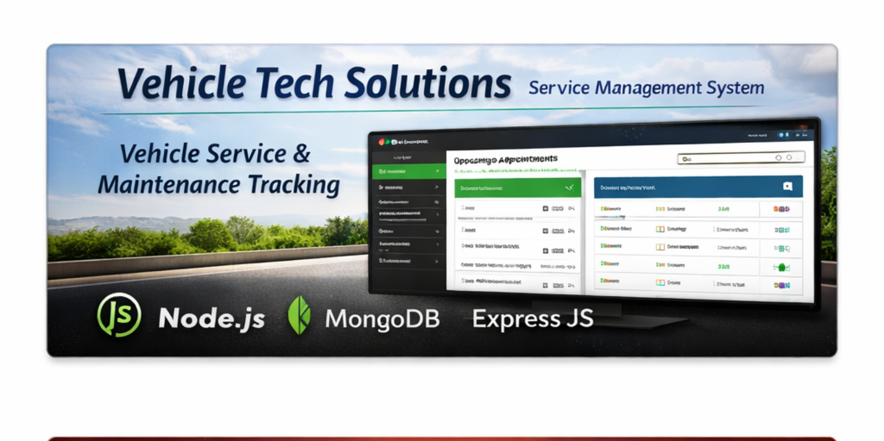
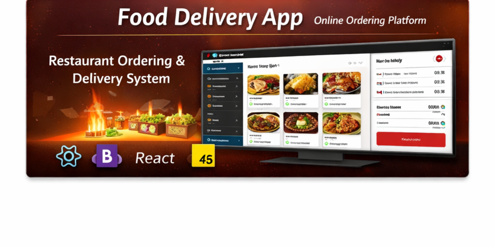

  

    

  

 

  
I am a dedicated developer focused on creating robust, full-stack applications with clean UI/UX and efficient backends. Always eager to learn new technologies and solve complex real-world problems.

 

---

### 🚀 Technical Arsenal

  
    
  
<b>Core Stack:</b> MongoDB | Express.js | React.js | Node.js | Python

---

### 🛠️ Featured Projects

Recruiters and visitors can check out my recent full-stack applications below.

<table align="center">
  <tr>
    <td width="50%" align="center">
      <b>🚗 Vehicle Tech Solutions</b> 
      <i>Service Management & Maintenance Tracking</i>
    </td>
    <td width="50%" align="center">
      <b>🍔 Food Delivery App</b> 
      <i>Online Restaurant Ordering Platform</i>
    </td>
  </tr>
  <tr>
    <td>
      
    </td>
    <td>
      
    </td>
  </tr>
  <tr>
    <td>
      
A comprehensive real-time fleet management and vehicle servicing platform designed to track maintenance schedules, handle appointments, and streamline service garage operations.

       
      <b>Tech Stack:</b> 
       
      
      
      
    </td>
    <td>
      
A responsive online ordering platform featuring a dynamic restaurant menu, cart management, and a streamlined checkout system for an optimized user experience.

       
      <b>Tech Stack:</b>
       
      
      
    </td>
  </tr>
</table>

---

### 📈 GitHub Analytics

  

---

### 📫 Let's Connect!

  
Feel free to reach out for collaborations, job opportunities, or just to say hi!

  
  
  
  
  

 

  

